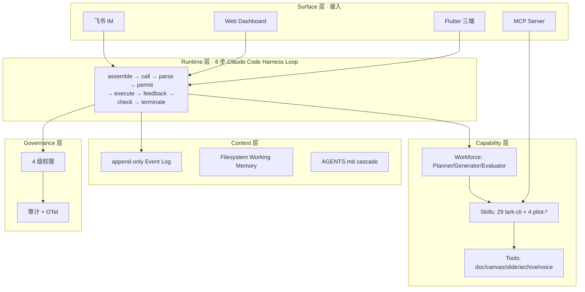

# Agent-Pilot V1

> **飞书 IM 中的 AI 主驾驶 Harness · 从一句话到方案文档 + 架构画布 + 演示稿 + 演讲稿，90 秒交付**

[](https://python.org)
[](LICENSE)
[]()
[](docs/ARCHITECTURE.md)

---

## 一句话

在飞书直接说：

> 帮我写一份关于 AI Agent 发展趋势的报告

Agent-Pilot 自动完成：

1. **三闸门意图识别**（Routing 模式）
2. **三 Agent Harness 规划**（Planner / Generator / Evaluator，借鉴 Anthropic 2026-03 长任务最佳实践）
3. **8 步 Claude Code Harness Loop** 编排（assemble → call → parse → permit → execute → feed → check → terminate）
4. **真产物**：飞书 Docx · 真 `.pptx` 文件 · Mermaid + tldraw 画布 · 演讲稿 + 可选 TTS
5. **多端 CRDT 同步**：飞书 IM、Web Dashboard、Flutter macOS/Android 通过 Yjs 实时一致

---

## 为什么 V1（相对 v13 / v12 / v3 / v4 全部废弃）

V1 是一次彻底重写，引入了 v13 完全没有的工程能力：

| 能力 | v13 | V1 |
|---|---|---|
| Agent 架构 | 工具 + 简陋 DAG | **5 层 Harness（Runtime/Context/Capability/Governance/Surface）** |
| 编排循环 | 自定义 orchestrator | **Claude Code 8 步 harness loop** |
| 长任务 | 单 LLM 8K tokens 串行（6 分钟） | **三 Agent GAN harness + Sprint 合约**（90 秒） |
| 飞书工具 | 自己拼 lark-oapi | **直接 load `larksuite/cli` 29 个官方 SKILL** |
| 反向调用 | 无 | **MCP server 反向暴露**，Cursor/Claude/Trae 可调 V1 |
| 缓存 | 命中率 0 | **`SYSTEM_PROMPT_DYNAMIC_BOUNDARY` 两段缓存** |
| Working Memory | 7000 字 markdown 塞 history | **`artifact://...` handle 引用** |
| 权限 | 无 | **4 级权限网关 deny → allow → classifier → ask** |
| 多端 | Flutter 38 行空壳 | **pycrdt-websocket 真 CRDT + yjs-flutter 三端** |

---

## 评分对照表（裁判 30 秒能验证每条）

| 维度 | 赛题/PRD 要求 | V1 落地 | 证据 |
|------|---|---|---|
| **完整性 50%** | Must-1 多端框架 | pycrdt-websocket Hub + Flutter 三端 | [`pilot/surface/sync/`](pilot/surface/sync/) · [`flutter_client/`](flutter_client/) |
| | Must-2-A 意图入口 | 文本 + 语音；自然语言 + `/pilot` | [`pilot/runtime/intent_router.py`](pilot/runtime/) |
| | Must-2-B 任务理解 | LangGraph state machine + Few-Shot Planner | [`pilot/runtime/planner.py`](pilot/runtime/) |
| | Must-2-C 文档/白板 | 飞书 Docx + 飞书白板 + tldraw + Mermaid | [`pilot/capability/skills/pilot-doc/`](pilot/capability/skills/pilot-doc/) |
| | Must-2-D 演示稿 | 真 .pptx（5 模板）+ Slidev HTML + 演讲稿 | [`pilot/capability/skills/pilot-slide/`](pilot/capability/skills/pilot-slide/) |
| | Must-2-E 多端一致 | CRDT + 任务状态机锁定 | [`pilot/governance/owner_lock.py`](pilot/governance/) |
| | Must-2-F 归档交付 | 飞书分享链接 + 任务中心 | [`pilot/capability/skills/pilot-archive/`](pilot/capability/skills/pilot-archive/) |
| | Must-3 自然语言 | 飞书 ASR + 三闸门 | [`pilot/capability/tools/voice.py`](pilot/capability/tools/) |
| **创新 25%** | AI 创新 | **5 层 Harness + 8 步 Loop + 三 Agent GAN harness** | [`docs/HARNESS_DESIGN.md`](docs/) |
| | 差异化 | **直接 load lark-cli 29 SKILL + 反向 MCP server** | [`pilot/capability/skills/lark-cli-skills/`](pilot/capability/skills/lark-cli-skills/) |
| | 可复用 | AGENTS.md cascade + SKILL.md 体系 | [AGENTS.md](AGENTS.md) |
| **技术 25%** | AI 深度 | LangGraph + 多 Provider + JSON safe + Few-Shot | [`pilot/llm/`](pilot/llm/) |
| | 架构合理 | 5 层 Harness 单向依赖 | [`docs/ARCHITECTURE.md`](docs/) |
| | 工程规范 | pre-commit + pytest + ruff + OpenTelemetry | [`pyproject.toml`](pyproject.toml) |
| | 稳定性 | 4 级权限 + 沙箱 + 审计 + 429 退避 | [`pilot/governance/`](pilot/governance/) |

---

## 快速开始

### 一、本地开发

```bash
git clone https://github.com/bcefghj/Agent-Pilot.git
cd Agent-Pilot

# 1. 安装依赖
python3.10 -m venv .venv && source .venv/bin/activate
pip install -e ".[dev]"

# 2. 配置环境
cp .env.example .env
# 必填：FEISHU_APP_ID / FEISHU_APP_SECRET / MINIMAX_API_KEY 或 ANTHROPIC_API_KEY

# 3. 跑 Mock 端到端测试
pytest tests/competition/ -v

# 4. 启动飞书 Bot + Dashboard
python -m pilot all
# 访问：
#   Web Dashboard:    http://localhost:8001/dashboard
#   多端实时监控:     http://localhost:8001/multi-end
#   API 文档:         http://localhost:8001/docs
#   MCP server:       http://localhost:8001/mcp
```

### 二、Flutter 客户端（macOS / Android / iOS / Web）

```bash
cd flutter_client
flutter pub get
flutter run -d chrome   # 最快验证
flutter run -d macos    # 桌面端
flutter build apk       # Android
```

### 三、Docker 一键

```bash
docker-compose up -d
```

---

## 飞书机器人使用

直接发以下任意一条：

| 想要什么 | 直接说 |
|---|---|
| 文档 | `帮我写一份关于 X 的报告` |
| PPT | `做一份 8 页客户汇报 PPT` |
| 架构图 | `画一张产品架构图` |
| **三件套** | `产品方案 + 架构图 + 评审 PPT` ⭐ |
| 模糊意图 | `帮我做个汇报` → Agent 主动澄清 |

或显式命令：

| 命令 | 作用 |
|---|---|
| `/pilot <意图>` | 强制触发 Pilot 流程 |
| `/plan <意图>` | 只规划不执行 |
| `状态` | 当前任务进度 |
| `帮助` | 完整使用卡片 |

**预计耗时**：60-90 秒，依意图复杂度而定（v13 是 360 秒）。

---

## 5 层 Harness 架构总览



详见 [`docs/ARCHITECTURE.md`](docs/ARCHITECTURE.md)。

---

## 项目结构

```
Agent-Pilot/
├── pilot/                          # ★ V1 单一 Python 包
│   ├── runtime/                    # 8 步 harness loop · 状态机 · 检查点
│   ├── context/                    # 事件日志 · ContextPack · filesystem 内存
│   ├── capability/                 # 工具 · Skills · Workforce · MCP 客户端
│   ├── governance/                 # 4 级权限 · owner_lock · 沙箱 · 审计
│   ├── surface/                    # 飞书 IM · Dashboard · Flutter sync · MCP/ACP server
│   └── llm/                        # 多 Provider · safe_json · few_shot
├── flutter_client/                 # 真 macOS/Android/Web 三端
├── tests/competition/              # 5 条裁判级 e2e 用例
├── scripts/                        # deploy.sh / backup_legacy.sh / judge_demo.py
├── docs/                           # JUDGE_GUIDE / ARCHITECTURE / PRD_COVERAGE / DEMO_SCRIPT
├── AGENTS.md                       # ★ Agent 项目指令（Claude Code / Cursor cascade）
└── README.md
```

---

## 文档

- [JUDGE_GUIDE.md](docs/JUDGE_GUIDE.md) — 裁判 5 分钟验收
- [ARCHITECTURE.md](docs/ARCHITECTURE.md) — 5 层 Harness 详解 + Claude Code 8 步映射
- [PRD_COVERAGE.md](docs/PRD_COVERAGE.md) — 队友 3 份 PRD 100% 对照
- [HARNESS_DESIGN.md](docs/HARNESS_DESIGN.md) — Harness 工程设计专题
- [DEMO_SCRIPT.md](docs/DEMO_SCRIPT.md) — 答辩演讲稿
- [AGENTS.md](AGENTS.md) — Agent 工作指南（在本仓库工作的 AI 应先读）

---

## 设计灵感（已查证）

- Anthropic [Building Effective Agents](https://www.anthropic.com/engineering/building-effective-agents) (2024-12)
- Anthropic [Harness Design for Long-running Apps](https://www.anthropic.com/engineering/harness-design-long-running-apps) (2026-03)
- [Modern Agent Harness Blueprint 2026](https://gist.github.com/amazingvince/52158d00fb8b3ba1b8476bc62bb562e3)
- Sid Bharath [The Anatomy of Claude Code](https://sidbharath.com/blog/the-anatomy-of-claude-code/)
- Cognition [Don't Build Multi-Agents](https://cognition.ai/blog/dont-build-multi-agents)
- 飞书官方 [`larksuite/cli`](https://github.com/larksuite/cli) · [`larksuite/lark-openapi-mcp`](https://github.com/larksuite/lark-openapi-mcp) · [`larksuite/openclaw-lark`](https://github.com/larksuite/openclaw-lark)
- [Yjs / pycrdt-websocket](https://github.com/y-crdt/pycrdt-websocket)

---

## 团队

| 成员 | 角色 |
|------|------|
| [戴尚好](https://bcefghj.github.io) | 全栈开发 / Agent 安全 / 部署 / 答辩 |
| [李洁盈](https://janeliii.netlify.app/) | 产品设计 / UI·UX / 内容运营 / 演讲 |

---

## License

[MIT](LICENSE) · Copyright © 2026 戴尚好 & 李洁盈
