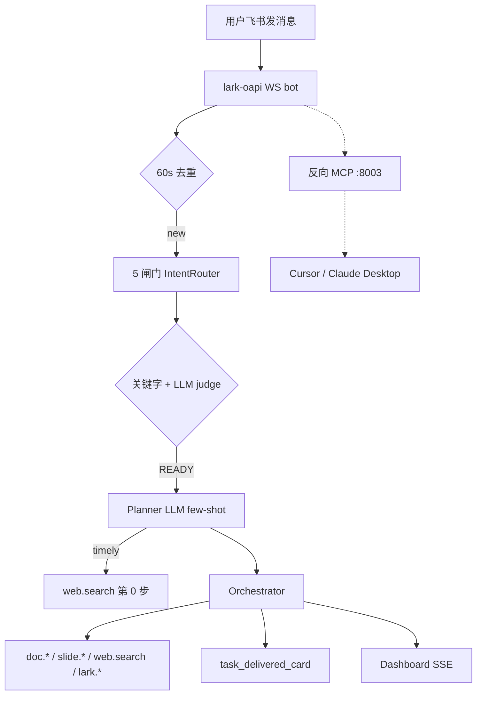

# Agent-Pilot V1.5

> **飞书 IM 中的 AI 主驾驶 · 从一句话到方案文档 + PPT + 演讲稿，90 秒交付**

[](https://python.org)
[](LICENSE)
[](CHANGELOG-v1.5.md)
[]()

---

## 一句话

在飞书直接说：

> 谢娜成都演唱会三件套

Agent-Pilot 自动完成：

1. **5 闸门意图识别**（命令 → /pilot → 关键字 → LLM judge → 闲聊兜底）
2. **联网搜索**（DDG + Bing 双兜底，时效词 / 事件名自动触发）
3. **Planner 规划**（LLM-driven + 8 例 few-shot + 启发式 fallback）
4. **真产物**：飞书 Docx（引用真实搜索数据）· 真 `.pptx` 文件 · 演讲稿
5. **实时 Dashboard**：中文化事件流 + 进度条 + SSE 实时推送

---

## V1.5 核心特性

| 特性 | 实现 | 证据 |
|---|---|---|
| 5 闸门 IntentRouter | 命令/显式/关键字/LLM/闲聊，不沉默 | [`pilot/runtime/intent_router.py`](pilot/runtime/intent_router.py) |
| 真联网搜索 | DDG HTML + Bing CN，无需 API key | [`pilot/llm/web_search.py`](pilot/llm/web_search.py) |
| MiniMax-only LLM | 锁死 M2.7-highspeed，30s retry | [`pilot/llm/client.py`](pilot/llm/client.py) |
| 飞书 OpenAPI 真集成 | im.fetch_thread / doc.search / bitable.search | [`pilot/capability/tools/lark_tools.py`](pilot/capability/tools/lark_tools.py) |
| 反向 MCP Server | :8003 暴露 4 工具给 Cursor/Claude Desktop | [`pilot/surface/lark_mcp_runner.py`](pilot/surface/lark_mcp_runner.py) |
| 10 状态机 | LEGAL_TRANSITIONS 校验 + stage_owners | [`pilot/runtime/session.py`](pilot/runtime/session.py) |
| Dashboard 中文化 | 事件 i18n + 进度条 + 30s heartbeat | [`pilot/surface/dashboard/`](pilot/surface/dashboard/) |
| OpenClaw 兼容 | 字段对照（不 vendor submodule） | [`docs/OPENCLAW_COMPAT.md`](docs/OPENCLAW_COMPAT.md) |

---

## 快速开始

### 本地开发

```bash
git clone https://github.com/bcefghj/Agent-Pilot.git && cd Agent-Pilot
python3 -m venv .venv && source .venv/bin/activate
pip install -e ".[bot,dashboard]"
cp .env.example .env  # 填 FEISHU_APP_ID / FEISHU_APP_SECRET / MINIMAX_API_KEY

# 跑全量测试（LLM_MOCK）
LLM_MOCK=1 pytest tests/ -q
LLM_MOCK=1 python scripts/run_t20_smoke.py

# 启动全部服务
python -m pilot all
# Dashboard: http://localhost:8001
# MCP:       http://localhost:8003/sse
```

### 服务器一键部署（Ubuntu 22.04）

```bash
ssh root@8.136.98.175
curl -fsSL https://raw.githubusercontent.com/bcefghj/Agent-Pilot/main/scripts/server/install.sh | bash
nano /opt/agent-pilot/.env   # 填飞书 + MiniMax 凭据
systemctl start agent-pilot-bot
```

详见 [`docs/DEPLOY.md`](docs/DEPLOY.md)。

### Cursor / Claude Desktop 接入反向 MCP

编辑 `~/.cursor/mcp.json`：

```json
{"mcpServers": {"agent-pilot": {"url": "http://8.136.98.175/sse"}}}
```

详见 [`docs/MCP_USAGE.md`](docs/MCP_USAGE.md)。

---

## 飞书机器人使用

| 想要什么 | 直接说 |
|---|---|
| 文档 | `帮我写一份关于 X 的报告` |
| PPT | `做一份 8 页客户汇报 PPT` |
| 架构图 | `画一张产品架构图` |
| **三件套** | `产品方案 + 架构图 + 评审 PPT` |
| **联网三件套** | `谢娜成都演唱会三件套` |
| 联网文档 | `今年最新 AI Agent 进展文档` |
| 模糊意图 | `帮我做个汇报` → 主动澄清 |
| 闲聊 | `你好` / `谢谢` → 友好回复，不沉默 |
| 命令 | `帮助` / `状态` / `/pilot <意图>` |

---

## 架构



---

## 项目结构

```
Agent-Pilot/
├── pilot/
│   ├── runtime/          # IntentRouter · Planner · Orchestrator · Session 状态机
│   ├── context/          # EventLog · ContextPack · Filesystem Memory
│   ├── capability/tools/ # doc · slide · canvas · web_media · lark_tools
│   ├── governance/       # 权限 · 审计 · owner_lock
│   ├── surface/
│   │   ├── feishu/       # lark-oapi WS bot · CardKit 卡片
│   │   ├── dashboard/    # FastAPI SSE Dashboard
│   │   └── lark_mcp_runner.py  # 反向 MCP server
│   └── llm/              # MiniMax client · web_search · safe_json
├── scripts/
│   ├── server/           # install.sh 一键部署
│   ├── systemd/          # 3 个 unit
│   ├── nginx/            # 反代配置
│   └── run_t20_smoke.py  # T1-T20 烟雾测试
├── tests/
│   ├── unit/             # 131 单测
│   └── competition/      # 7 竞赛 e2e
├── docs/
│   ├── DEPLOY.md         # 服务器部署
│   ├── MCP_USAGE.md      # Cursor/Claude 接入
│   ├── OPENCLAW_COMPAT.md # OpenClaw 字段对照
│   └── JUDGE_TEST_REPORT.md # T1-T20 评测
├── CHANGELOG-v1.5.md
├── .env.example
└── README.md
```

---

## 测试

```bash
# 全量单测 + e2e
LLM_MOCK=1 pytest tests/ -q          # 131 + 7 = 138 全绿

# T1-T20 链路烟雾
LLM_MOCK=1 python scripts/run_t20_smoke.py   # 20/20

# 服务器健康
curl http://8.136.98.175/health
curl http://8.136.98.175/tools/list | jq
```

---

## 文档

- [DEPLOY.md](docs/DEPLOY.md) — 服务器部署 + 故障排查
- [MCP_USAGE.md](docs/MCP_USAGE.md) — Cursor / Claude Desktop 接入
- [OPENCLAW_COMPAT.md](docs/OPENCLAW_COMPAT.md) — OpenClaw 卡片协议对照
- [JUDGE_TEST_REPORT.md](docs/JUDGE_TEST_REPORT.md) — T1-T20 评测报告
- [CHANGELOG-v1.5.md](CHANGELOG-v1.5.md) — V1.5 完整变更
- [ARCHITECTURE.md](docs/ARCHITECTURE.md) — 架构设计

---

## 差异化（vs 其他参赛队）

1. **不沉默**：CHAT verdict 兜底，闲聊也有友好回复
2. **真联网**：DDG + Bing 双兜底，时效词/事件名自动触发 web.search
3. **真飞书集成**：im.fetch_thread / doc.search / bitable.search 用 OpenAPI，不 vendor 24 SKILL
4. **反向 MCP**：评委 Cursor 可直接调我们 4 个工具
5. **诚实**：不夸大命名、不写假集成、CHANGELOG 列清"做了/没做"

---

## 团队

| 成员 | 角色 |
|------|------|
| [戴尚好](https://bcefghj.github.io) | 全栈开发 / Agent 架构 / 部署 |
| [李洁盈](https://janeliii.netlify.app/) | 产品设计 / UI·UX / 内容运营 |

---

## License

[MIT](LICENSE) · Copyright © 2026 戴尚好 & 李洁盈
